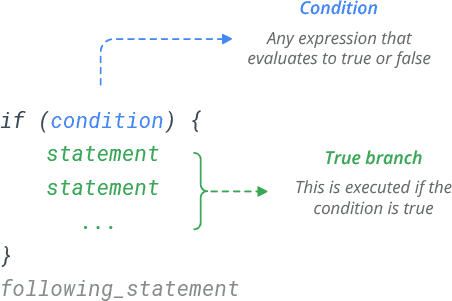
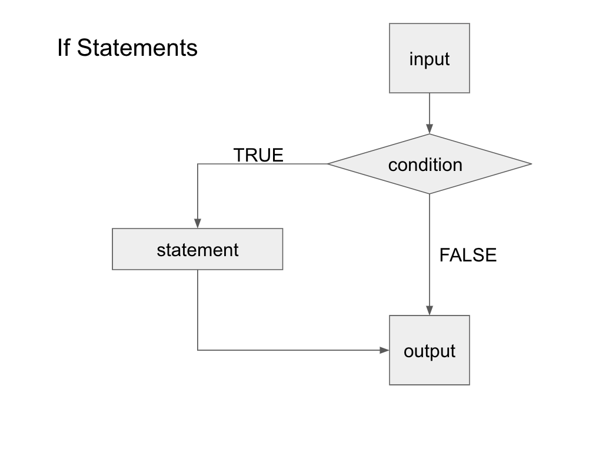
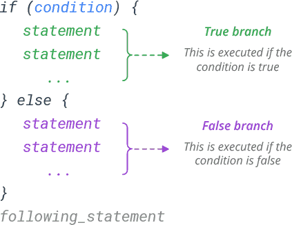
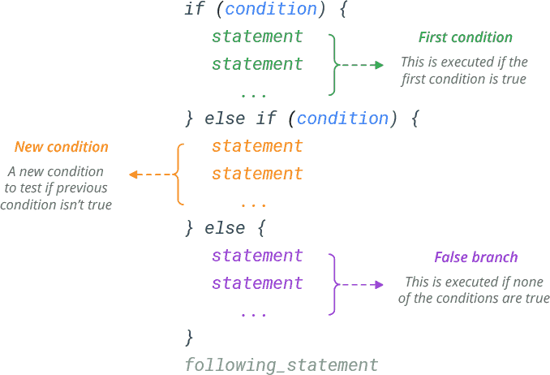

<h2> Lesson 4 - If Else Statements and Loops </h2> 

Now that we have a good understanding of how R works, let's begin to build structure into our scripts. If Else statments and loops help us to accomplish a large amount of tasks efficiently while optimizing your script. 

<h2> If Else Statments </h2> 

Often, you need to execute some statements only when some condition is met. The way if else statements work is by taking an input and checking if that condition is met. These statements only work when your condition results in a TRUE or FALSE answer. 

<h4> If Statements </h4>

Let's do an example where we want to make a comparison between two values, x and y. 

	x <- 2
	y <- 4
	if(x<y){
		print("x is less than y")
	} 
	[1] "x is less than y"
	
The format of these statements will always follow the same structure. Start with the evaluation: if. You put your condition into round brackets. You then put squiggly brackets {}. Your statement then goes inside those curly brackets. When you're writing this in your R script, you can hit enter after the {, all your statments will then be indented on the next line accordingly. Keeping this format makes your code easy to read and becomes increasingly important when you start embedding statements and loops within each other. 

Let's change our x value to a greater value than y. 

	x <- 5 
	if(x<y){
		print("x is less than y")
	} 
	
After evaluating this is statement, nothing was printed. This is because the condition was NOT met and the statement was not evaluated. 

The key aspect of these statements is that your condition results in a TRUE or FALSE answer. Here's a flow chart to visualize what we just did. 

Now, let's say we wanted to have a statement for when x is greater than y (like in the second example). We can add an else statement to the code. 

<h4> Else Statements </h4>

The else statement is for when your condition is not met. Here, the condition is x<y. This is as if we are asking "is x less than y?". In this case, x is not less than y and this does not meet our condition. So instead of evaluating the if statement, R will evaluate the else statement. 

	x <- 5 
	y <- 4 
	if(x<y){
		print("x is less than y")
	} else {
		print("x is greater than y")
	}
	[1] "x is greater than y"

<h4> If Else Statements </h4>

If else statements are used when you have multiple conditions you want to test 

	x <- 5 
	y <- 5
	if(x<y){
		print("x is less than y")
	} if else(x>y){
		print("x is greater than y")
	} else {
	 	print("x is equal to y")
	}
	[1] "x is equal to y"

You can add as many if else conditions as you need. 

<h2> Loops </h2> 

Loops are used to repeat a specific block of code. There are two types of loops that are commonly used. These are the "for" and "while" loops 

<h4> For Loops </h4> 

For loops have the following structure: 

for (*val* in *sequence*)
{
*statement*
}

where the *statement* is the block of code you want to repeat, *sequence* is your vector that you are wanting to loop through and *val* is a variable that takes on  the value of each element in *sequence*. The code will start by taking the first element and evaluate the statement. Once the statement is evaluating, val will then take on the next element in your vector. The process repeats until the last element of your vector has been evaluated.

For example, lets count how many even numbers exist between 1 and 10. 

	x <- 1:10
	c <- 0 # set counter to 0
	evens = c() # make an empty vector to store 

	for(i in x){
		if(i%%2 == 0){
	  		c = c+1
	  		evens = c(evens,i)
		} # /end if
	} #end i
  
    print(paste("Even values:", paste(evens,collapse = ",")))
    print(paste("Total number of even values:",c))
	
Tip: the %% operator, called the modulus operator, finds the remainder of the first value divided by the second value. So in this example, the loop checks every value between 1 and 10 and checks if the remainder is equal to 0 or not. If it is, the counter will increase by one and we add i to the evens vector.

We can also put loops inside of loops. This is helpful when you are working with a matrix. Let's jump into an example were we want to specifically set each element in a 10x10 matrix to a specific value. The key here is that the element's value is dependant on the row and column position. For this example, we are going to set the value of the element to be the product of the row and column numbers (so basically a multiplication's table). 

	 # Create a 10 x 10 matrix 
 	 mymat <- matrix(nrow=10, ncol=10)
  
	  # For each row and for each column, assign values based on position: product of two indexes
	  for(irow in 1:nrow(mymat)) {
		for(icol in 1:ncol(mymat)) {
		  mymat[irow,icol] = irow*icol
		}# end icol
	  }# end irow
  
`	 print(mymat)

You can nest loops in each other as many times as you need. Keep in mind that your *val* name has to be something different for every loop. Commonly, people use i,j,k... I also like to just preface my variable with i. For instance, irow, iyear, iday. That makes a more descriptive name for you to recognize. I also recommend commenting after your final end bracket with the name of your variable (as seen in the previous examples). This is especially important when you have a large chunk of code inside the loop. Here's one last example on a 3D array: 

	# Create your three-dimensional array
	my_array <- array()

	for (i in 1:dim(my_array)[1]) {
	  for (j in 1:dim(my_array)[2]) {
		for (k in 1:dim(my_array)[3]) {
		  my_array[i,j,k] = i*j*k
		}
	  }
	}
	
	print(my_array)
 
<h4> While Loops </h4> 

For loops are designed to loop through your array until you reach the final value. While loops differ from for loops because they will only continue until a condition is met. The syntax of while loops looks exactly the same as for loops. 

	while (test_expression)
	{
	statement
	}
Here, the test_expression is evaluated and the body of the loop is entered if the result of your test_xpression TRUE. The statements inside the loop are executed and the flow returns to evaluate the test_expression again. This is repeated each time until test_expression evaluates to FALSE, in which case, the loop exits.

	i <- 1
	while (i < 6) {
	print(i)
	i = i+1
	}

We first initialized i by setting it to 1. We then began the while loop where the expression "i < 6" is evaluated. With i == 1, the result of our expression is TRUE and we enter the body of the loop. Everything inside in then executed (print and adjust i). You have to change the value of i here. R doesn't automatically increase it's value. The loop ends when the expression results in FALSE (i = 6). 

Here's another example. Let's say you buy a stock at $50 and you want to sell it for a profit of at least $5. If the price of the stock randomly fluctuates between $40 and $60, we want to be notified when we surpass our $5 profit margin. Here's how we set this code up: 

	
	# Initialize loop counter. This is just to keep track of how many times we loop.
	loop <- 1

	# Set variables price and stock
	price <- 50
	stock <- 50 

	# Set the while statement
	while (price < 55){

	  # Create a random price between 40 and 60
	  price <- stock + sample(-10:10, 1)

	  # Count the number of loop
	  loop = loop +1 

	  # Print the number of loop
	  print(loop)
	  print(paste("price =",price))
	  
	} #end while

