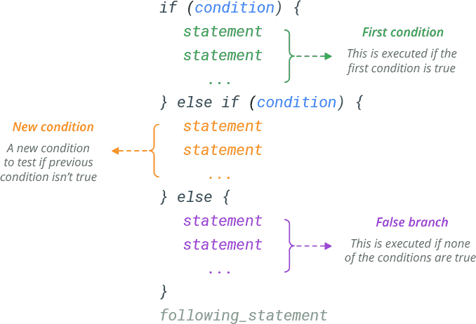

<h2> Lesson 4 - Statements and Loops </h2> 

Now that we have a good understanding of how R works, let's begin to build structure into our scripts. If Else statments and loops help us to accomplish a large amount of tasks efficiently while optimizing your script. 

<h2> If Else Statments </h2> 

Often, you need to execute some statements only when some condition is met. The way if else statements work is by taking an input and checking if that condition is met. These statements only work when your condition results in a TRUE or FALSE answer. 

<h4> If Statements </h4>

Let's do an example where we want to make a comparison between two values, x and y. 

	> x <- 2
	> y <- 4
	> if(x<y){
	+ 	print("x is less than y")
	+} 
	[1] "x is less than y"
	
The format of these statements will always follow the same structure. Start with the evaluation: if. You put your condition into round brackets. You then put squiggly brackets {}. Your statement then goes inside those curly brackets. When you're writing this in your R script, you can hit enter after the {, all your statments will then be indented on the next line accordingly. Keeping this format makes your code easy to read and becomes increasingly important when you start embedding statements and loops within each other. 

Let's change our x value to a greater value than y. 

	> x <- 5 
	> if(x<y){
	+ 	print("x is less than y")
	+} 
	
After evaluating this is statement, nothing was printed. This is because the condition was NOT met and the statement was not evaluated. 

The key aspect of these statements is that your condition results in a TRUE or FALSE answer. Here's a flow chart to visualize what we just did. 

Now, let's say we wanted to have a statement for when x is greater than y (like in the second example). We can add an else statement to the code. 

<h4> Else Statements </h4>

The else statement is for when your condition is not met. Here, the condition is x<y. This is as if we are asking "is x less than y?". In this case, x is not less than y and this does not meet our condition. So instead of evaluating the if statement, R will evaluate the else statement. 

	> x <- 5 
	> y <- 4 
	> if(x<y){
	+ 	print("x is less than y")
	+} else {
	+	print("x is greater than y")
	+}
	[1] "x is greater than y"

<h4> Else If Statements </h4>

<h2> Loops </h2> 

<h4> For Loops </h4> 
<h4> While Loops </h4> 
